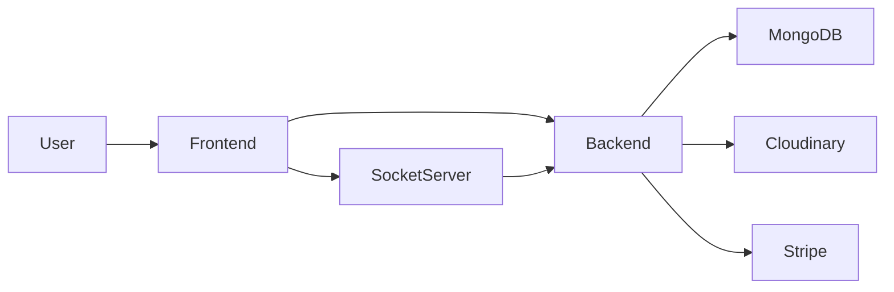
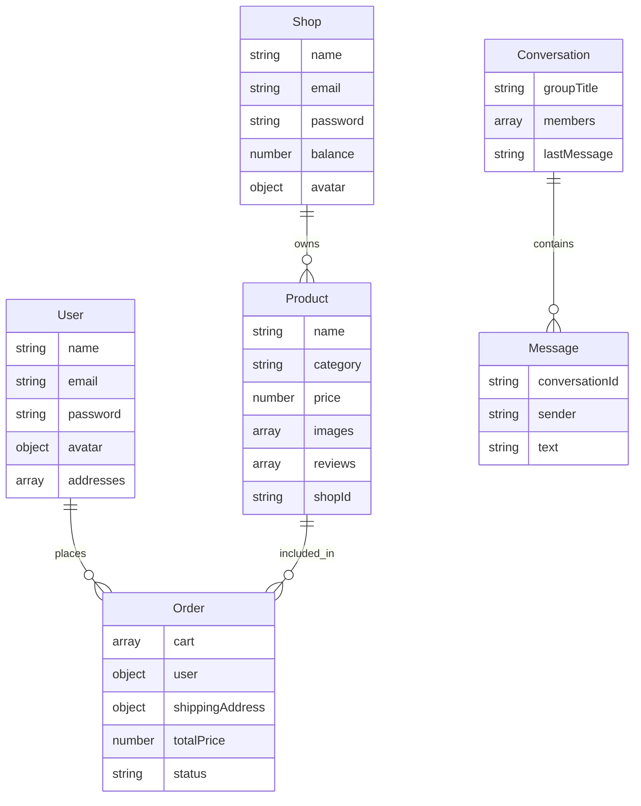
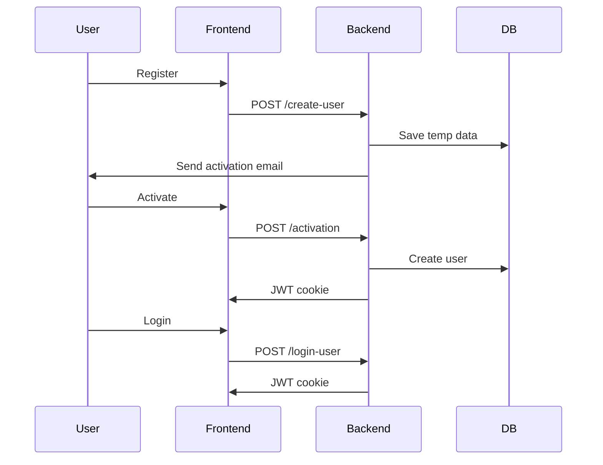
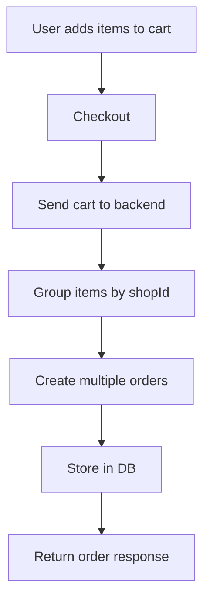
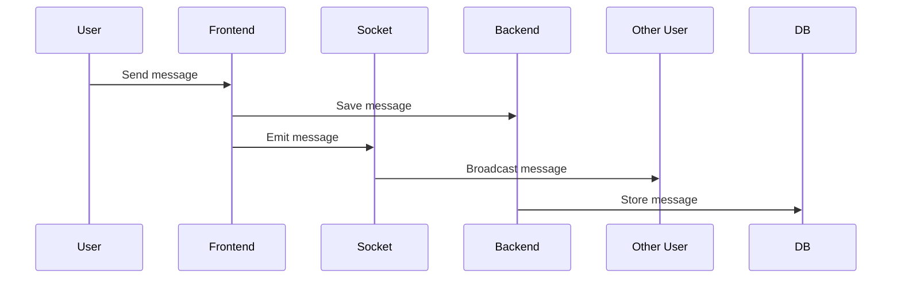
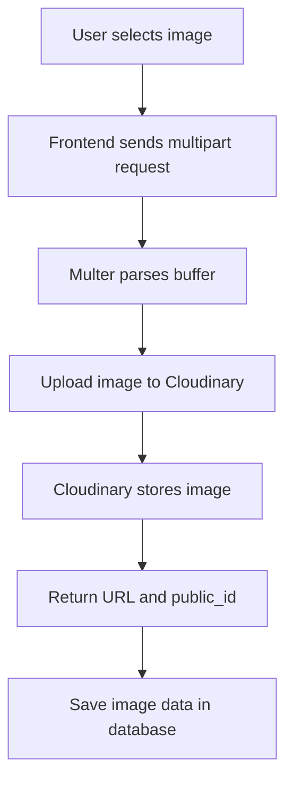
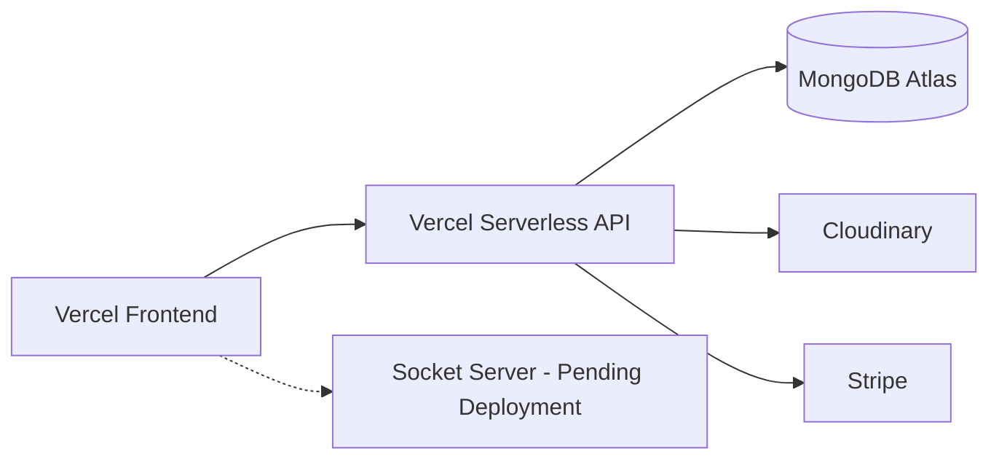

# E-Shop – Full Stack MERN Marketplace 

##  Live Links

**Frontend:** https://e-shop-5v54.vercel.app/  
**Backend:** https://e-shop-two-sage.vercel.app/  

---

##  Project Overview

E-Shop is a full-stack multi-vendor ecommerce platform.

Users can browse products, place orders, and chat with sellers.  
Shops can manage products, orders, and withdrawals.  
Admins can monitor users, shops, orders, and system activity.

## Key Features

Multi-vendor ecommerce system  
JWT authentication with email verification  
Stripe payment integration  
Cloudinary image handling  
Realtime messaging using Socket.IO  
Admin dashboard for full system control  

## Feature List with Technical Implementation

- User authentication is implemented using JWT stored in cookies. Passwords are hashed using bcrypt before saving in MongoDB through pre-save hooks.
- User registration uses an email activation flow. A temporary JWT token is generated and sent via email, and the account is only created after activation.
- Shop authentication is implemented similarly but uses a separate cookie seller_token. Shops are stored in a separate collection and have role-based permissions.
- Products are created by shops using multipart upload handled by multer. Images are streamed to Cloudinary using buffer uploads instead of disk storage.
- Events are time-based promotional products stored in a separate collection. They include start and finish dates and are filtered on the frontend.
- Orders are created by splitting cart items per shop. Each shop gets its own order document. This logic is implemented using a Map grouping by shopId.
- Payments are processed using Stripe Payment Intents. The backend generates a client secret which is used on the frontend.
- Reviews are embedded inside the product document. The system checks if a user already reviewed a product and updates instead of duplicating.
- Conversations and messages implement a chat system. Conversations store members and last message. Messages are stored separately and linked via conversationId.
- Withdraw requests allow shops to request payouts. Admin can approve them and transactions are recorded in the shop document.
- Admin panel allows viewing users, shops, products, orders, events, and withdrawals. Access is controlled via role-based middleware.

## Tech Stack

- Backend uses Node.js with Express and MongoDB via Mongoose. Stripe SDK is used for payments. Cloudinary is used for media storage.
- Frontend uses React with Vite. Redux Toolkit is used for state management. Axios is used for API calls.
- Socket server uses Node.js with Socket.IO.
- Database is MongoDB.
- Deployment uses Vercel for frontend and backend. Socket server is pending deployment.

## System Architecture

## Database Schema

## Authentication Flow

## Order Flow

## Socket / Realtime Messaging Flow

## Image Upload Flow (Cloudinary)

## API Endpoints

| Method | Endpoint                                   | Description                 |
|--------|--------------------------------------------|-----------------------------|
| POST   | /user/create-user                          | Register user               |
| POST   | /user/login-user                           | Login user                  |
| GET    | /user/getuser                              | Get user                    |
| POST   | /shop/create-shop                          | Register shop               |
| POST   | /shop/login-shop                           | Login shop                  |
| GET    | /product/get-all-products                  | Get products                |
| POST   | /product/create-product                    | Create product              |
| POST   | /order/create-order                        | Create order                |
| GET    | /order/get-all-orders/:id                  | User orders                 |
| POST   | /payment/process                           | Stripe payment              |
| POST   | /conversation/create-new-conversation      | Create chat                 |
| POST   | /message/create-new-message                | Send message                |

## Packages & Dependencies

### Frontend (React + Vite)

| Package | Version | Purpose |
|--------|--------|--------|
| react | ^19.2.0 | UI library |
| react-dom | ^19.2.0 | DOM rendering |
| react-router-dom | ^7.13.1 | Routing |
| redux / @reduxjs/toolkit | ^5.0.1 / ^2.11.2 | State management |
| react-redux | ^9.2.0 | Redux binding |
| axios | ^1.13.6 | API calls |
| socket.io-client | ^4.8.3 | Realtime communication |
| @mui/material | ^7.3.9 | UI components |
| @mui/x-data-grid | ^8.28.1 | Data tables |
| tailwindcss | ^4.2.1 | Styling |
| @tailwindcss/vite | ^4.2.1 | Tailwind + Vite integration |
| react-toastify | ^11.0.5 | Notifications |
| react-icons | ^5.5.0 | Icons |
| lottie-react | ^2.4.1 | Animations |
| react-lottie | ^1.2.10 | Animation support |
| timeago.js | ^4.0.2 | Time formatting |
| country-state-city | ^3.2.1 | Location data |
| @stripe/react-stripe-js | ^6.2.0 | Stripe frontend |
| @stripe/stripe-js | ^9.2.0 | Stripe SDK |
| @paypal/react-paypal-js | ^9.1.1 | PayPal integration |

---

### Backend (Node.js + Express)

| Package | Version | Purpose |
|--------|--------|--------|
| express | ^5.2.1 | Server framework |
| mongoose | ^9.2.3 | MongoDB ODM |
| jsonwebtoken | ^9.0.3 | Authentication |
| bcrypt | ^6.0.0 | Password hashing |
| multer | ^2.1.1 | File uploads |
| cloudinary | ^2.10.0 | Image storage |
| nodemailer | ^8.0.1 | Email service |
| stripe | ^22.0.2 | Payment processing |
| cookie-parser | ^1.4.7 | Cookie handling |
| cors | ^2.8.6 | Cross-origin requests |
| dotenv | ^17.3.1 | Environment variables |
| nodemon | ^3.1.14 | Dev server |

---

### Socket Server (Realtime)

| Package | Version | Purpose |
|--------|--------|--------|
| socket.io | ^4.8.3 | Realtime communication |
| express | ^5.2.1 | Server |
| cors | ^2.8.6 | CORS handling |
| dotenv | ^17.4.2 | Env config |
| nodemon | ^3.1.14 | Dev server |

---

## Build Tools

| Tool | Purpose |
|-----|--------|
| Vite | Frontend bundler |
| ESLint | Code linting |

## Case Study

This project was built to implement a complete multi-vendor ecommerce system with real-world features such as authentication, payments, media handling, and realtime communication.

The system is designed with three separate services: a frontend application, a backend API, and a socket server for realtime messaging. This separation allows the application to scale and keeps concerns isolated.

The backend follows a modular structure with controllers, models, and routes. MongoDB is used as the database, and Mongoose is used to manage schemas and queries. Authentication is handled using JWT stored in cookies, with separate flows for users and shops.

For file handling, local storage was avoided due to serverless deployment limitations. Instead, images are uploaded using multer in memory and streamed directly to Cloudinary, which returns secure URLs that are stored in the database.

The order system is designed to support multiple vendors. When a user places an order, the cart is split by shopId, and separate order records are created for each shop. This allows independent order management for each seller.

Realtime messaging is implemented using Socket.IO. Conversations are stored in the database, while messages are emitted through the socket server to provide instant communication between users and shops.

The project is deployed using Vercel for both frontend and backend. Since Vercel does not support persistent connections, the socket server is designed to run separately and is planned for deployment on a dedicated service.

Overall, the project demonstrates how to build and deploy a production-style ecommerce system using a serverless backend with external services for storage, payments, and realtime communication.

## Issues Faced & Solutions

### Issue 1 MongoDB Buffering Timeout
- Cause: Queries executed before DB connection  
- Fix: Added `process.exit(1)`, `serverSelectionTimeoutMS`, and `isConnected` guard  

### Issue 2 dotenv Not Loading Before DB
- Cause: ES module import hoisting  
- Fix: Moved dotenv to `config/loadEnv.js` and imported first  

### Issue 3 Wrong Entry File on Vercel
- Cause: `vercel.json` pointing to wrong file  
- Fix: Updated to `server.js` and added DB connection in `app.js`  

### Issue 4 connectDB Not Imported
- Cause: Missing import  
- Fix: Added `import connectDB` in `app.js`  

### Issue 5 Images Not Showing in Production
- Cause: Read-only filesystem on Vercel  
- Fix: Migrated uploads to Cloudinary and used memory storage  

### Issue 6 Frontend 404 on Refresh
- Cause: Missing SPA routing fallback  
- Fix: Added rewrite rule to `index.html`  

### Issue 7 Socket Deployment Problem
- Cause: Monorepo deployment confusion  
- Fix: Set Render Root Directory to `socket`   

---

## Key Learnings

- Serverless environments require stateless file handling  
- ES modules load order can break environment configs  
- MongoDB connection must be controlled in serverless apps  
- Cloudinary is required for persistent file storage on Vercel  
- SPA routing must be handled explicitly in production  

--- 

## Project Structure

backend/ # API server
frontend/ # React app
socket/ # Realtime server

## Deployment Architecture

## Final Notes

This project is structured as a scalable multi-service application with clear separation between API, client, and realtime layer. The architecture supports serverless APIs while maintaining realtime capabilities through a dedicated socket server.

